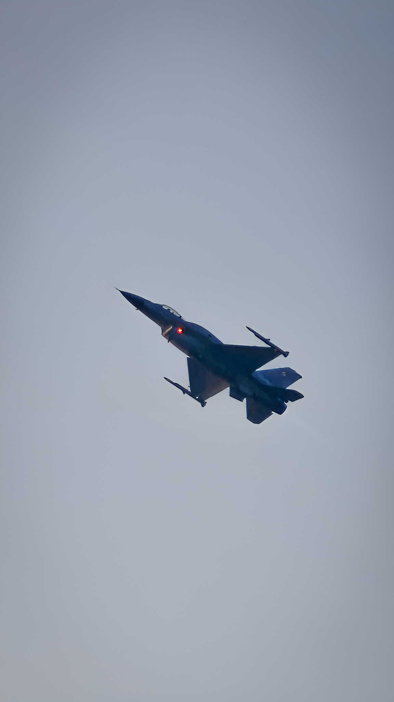
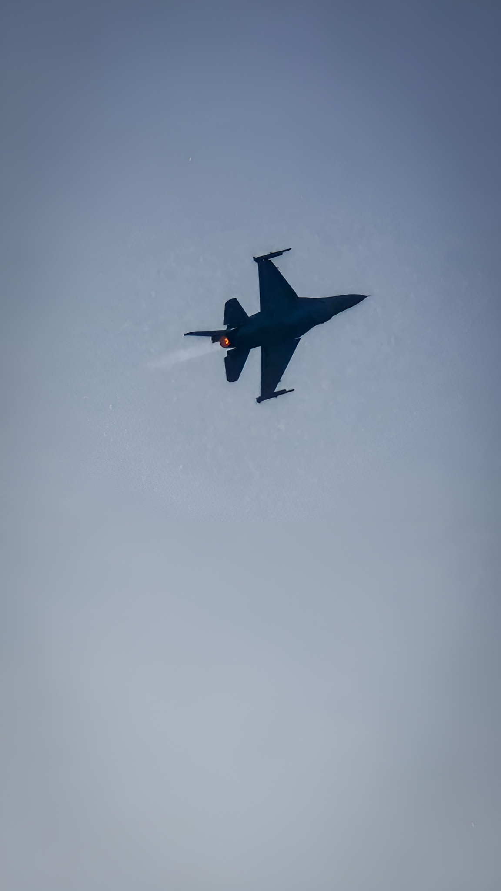
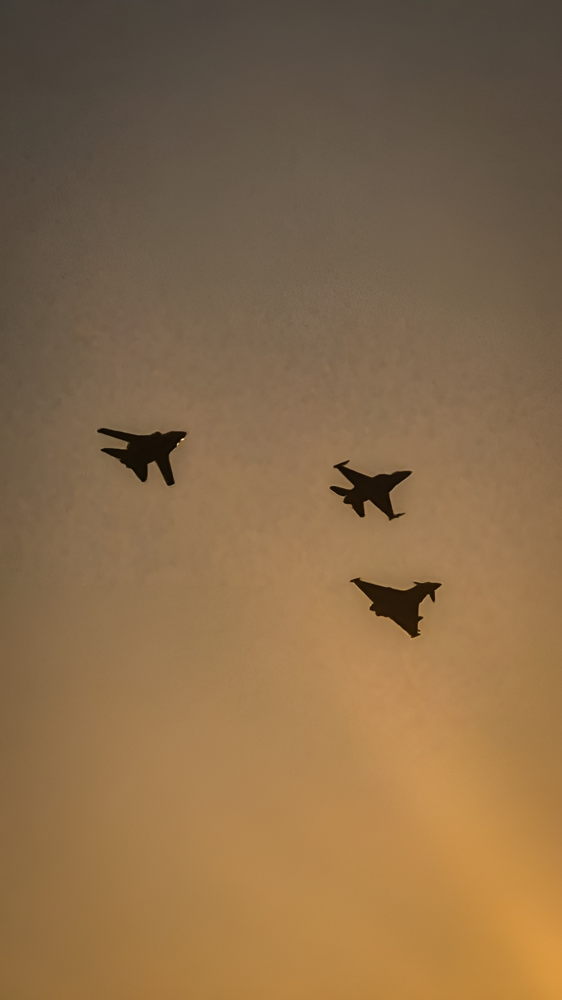
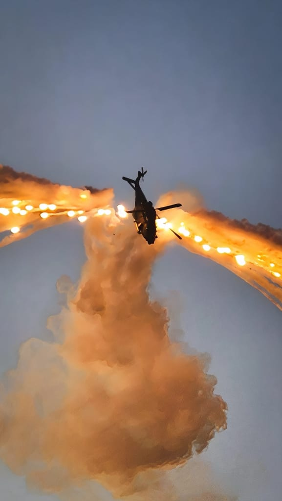
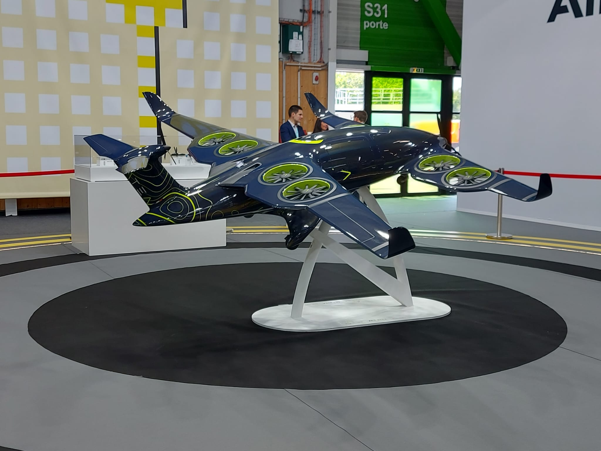
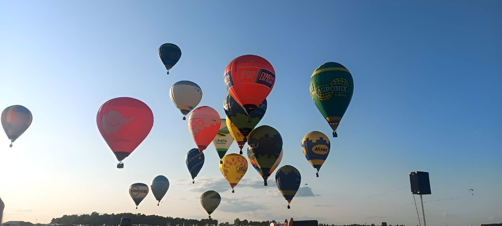

# 🛩️ Antidotum Airshow 2025

Photos prises lors de l’**Antidotum Airshow 2025** à Leszno (Pologne).  
Voici une sélection des appareils présents durant le meeting.

---

## ✈️ Avions de chasse

  
  
  

---

## ⚙️ Jets d'entraînement et avions légers

  
  
  

---

## 🪖 Avions historiques

  
  

  
  

---

## 🚁 Hélicoptères

  

---

## 🛠️ Autres

  
  
  

---

## 🎥 Vidéos
Les vidéos sont disponibles dans le dossier [`/Video`](./Video).

---

📸 *Toutes les photos ont été prises par moi lors du meeting Antidotum Airshow 2025.*
